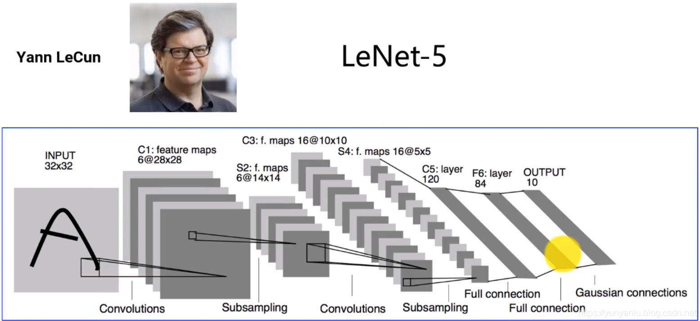
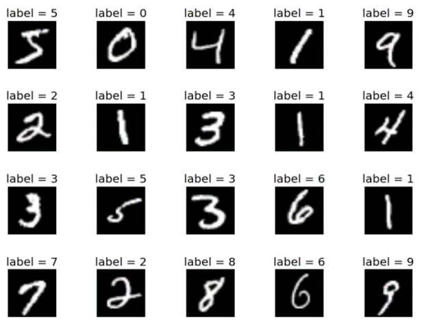
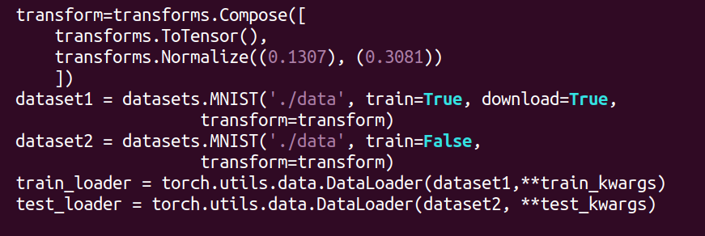
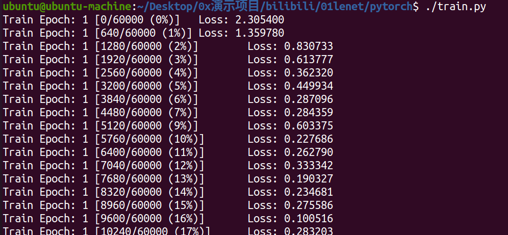
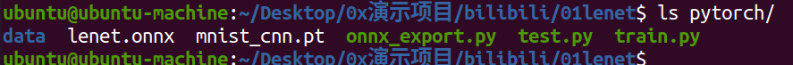
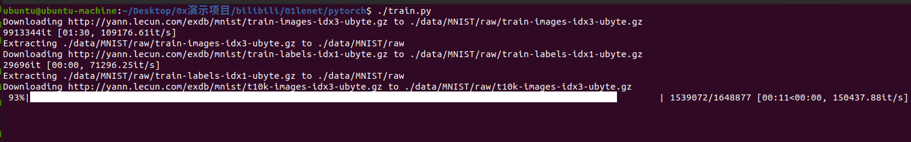
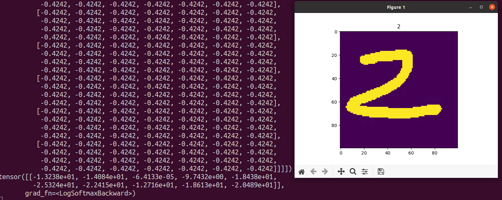
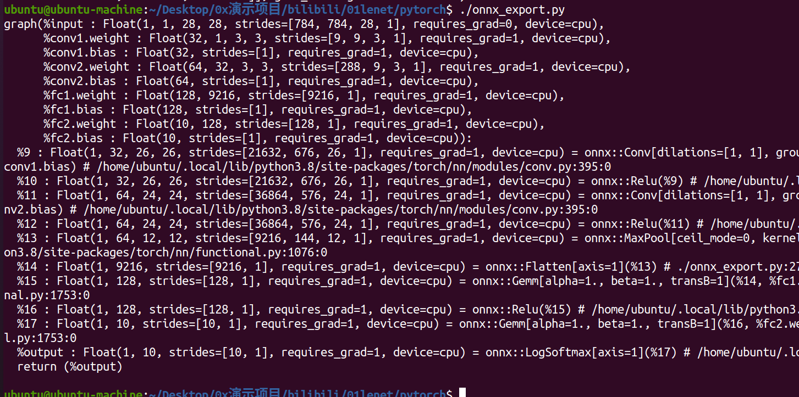
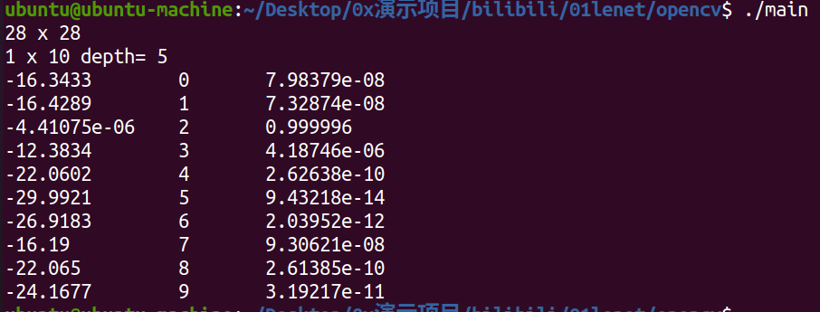

### 系统环境
- 虚拟机ubuntu20.04
- pytorch 1.8.0+cpu
- opencv 4.6.0

## 1.什么是lenet模型

> Lenet模型是深度学习中的经典卷积神经网络（Convolutional Neural Network，CNN）之一，由Yann LeCun等人在1998年提出。它是用于手写数字识别任务的早期CNN架构，也是第一个在实际应用中取得成功的深度学习模型之一。
> 
> LeNet模型在当时被用于解决美国邮政服务的手写数字识别问题，即将手写的邮政编码数字图像识别为实际的数字。这个问题被称为手写数字识别，是计算机视觉领域的一个经典任务。

LeNet模型的架构相对简单，主要由卷积层（Convolutional Layers）、池化层（Pooling Layers）、全连接层（Fully Connected Layers）组成。它的基本结构如下：


- 第一层：卷积层

 输入图像进行卷积操作，使用多个卷积核提取图像的特征。

- 第二层：池化层

 对卷积后的特征图进行下采样，减少数据维度，降低计算复杂性，保留重要信息。

- 第三层：卷积层

 再次进行卷积操作，提取更高级的特征。

- 第四层：池化层

 再次对特征图进行下采样。

- 第五层：全连接层

 将池化层的输出连接成一个向量。

- 第六层：全连接层

 输出最终的分类结果。

在现代的深度学习中，LeNet模型的架构可能显得相对简单，但它为后来更复杂的CNN架构奠定了基础，并证明了CNN在图像识别任务中的有效性。今天的深度学习模型通常比LeNet更深更复杂，但LeNet的历史地位使其成为深度学习领域的重要里程碑之一。


## 2.使用pytorch构建lenet网络模型

- 1.搭建网络

> ‵PyTorch提供了许多用于卷积以及激活函数等数学运算，可以方便的根据模型的网络结构构建神经网络模型。

```python
class Net(nn.Module):
    def __init__(self):
        super(Net, self).__init__()
        self.conv1 = nn.Conv2d(1, 32, 3, 1)
        self.conv2 = nn.Conv2d(32, 64, 3, 1)
        self.dropout1 = nn.Dropout(0.25)
        self.dropout2 = nn.Dropout(0.5)
        self.fc1 = nn.Linear(9216, 128)
        self.fc2 = nn.Linear(128, 10)

    def forward(self, x):
        x = self.conv1(x)
        x = F.relu(x)
        x = self.conv2(x)
        x = F.relu(x)
        x = F.max_pool2d(x, 2)
        x = self.dropout1(x)
        x = torch.flatten(x, 1)
        x = self.fc1(x)
        x = F.relu(x)
        x = self.dropout2(x)
        x = self.fc2(x)
        output = F.log_softmax(x, dim=1)
        return output

```

- 2.损失函数与优化器

> 损失函数用来评价模型的预测值和真实值不一样的程度，损失函数越好，通常训练得到的模型的性能越好。不同的神经网络模型用的损失函数一般也不一样，这里根据模型的输出层选择F.nll_loss作为损失函数。

> 优化器是基于Bp算法的一套优化策略。主要的作用是通过算法帮助模型在训练过程中，如何更快更好的将参数调整到位。

```python
#定义随机梯度下降优化器
optimizer = optim.Adadelta(model.parameters(), lr=args.lr)
loss = F.nll_loss(output, target)
```

## 3.数据集准备
- mnist数据集简介

> MNIST是一个手写体数字的图片数据集，该数据集来由美国国家标准与技术研究所（National Institute of Standards and Technology (NIST)）发起整理，一共统计了来自250个不同的人手写数字图片，其中50%是高中生，50%来自人口普查局的工作人员。该数据集的收集目的是希望通过算法，实现对手写数字的识别。[MNIST数据集官网](http://yann.lecun.com/exdb/mnist/)，该数据集中包含60,000个示例的训练集以及10,000个示例的测试集。
> 
> 

- 加载数据集

> 

> 使用PyTorch提供的数据集MNIST，使用torchvision.datasets.MNIST接口可以很方便的从PyTorch官网下载MNIST数据集，该数据集将以二进制的形式保存到本地。


## 4.训练、验证、导出onnx

- 1.训练模型

> 终端执行./train.py
> 
> 
>
>训练完成后就会得到模型文件
>
>


> 注意：执行时会自动判断数据集是否存在，不存在则会自动下载，下载完成开始训练
> 
> 


- 2.验证模型

> 准备一张黑底白字的图片（mnist数据集就是黑底白字）
> 
> 
> 
> 终端中执行./test.py
> 
> 

- 3.导出为onnx格式模型

> 终端执行onnx_export.py
> 
> 
> 
> 获得lenet.onnx

## 5.opencv推理onnx模型

- 1.opencv加载onnx模型

```c++
Net net = readNetFromONNX(modelsFile);
```

- 2.处理图像数据

```c++
Scalar mean(0.1307);
Scalar std(0.3081);

Mat frame = imread(imageFile);
cv::cvtColor(frame,frame,cv::COLOR_BGR2GRAY);
resize(frame,frame,Size(28,28));
frame.convertTo(frame, CV_32FC1, 1.0f/255.0f);

frame = (frame - mean)/std;
Mat inpBlob = blobFromImage(frame, 1.0, Size(28, 28), Scalar(0), true, true);

```

- 3.传入模型推理获取结果

```c++
net.setInput(inpBlob);
Mat out = net.forward();
cout<<out.size<<" depth= "<<out.depth()<<endl;

float *data = (float*)out.data;

for(size_t i=0;i<10;i++)
{
    std::cout<<data[i]<<"  \t"<<i<<"  \t"<<exp(data[i])<<std::endl;
}

```

